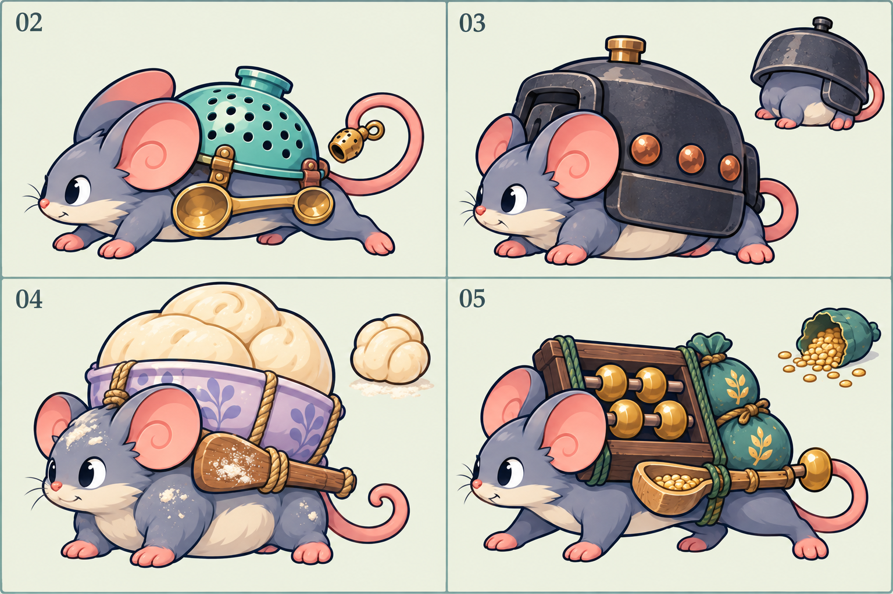

# 第二至第五大关鼠群与首领美术制作规范

日期：2026-09-26。状态：**制作规范已进入实施；16 新角色、技能与卸壳共 37 张源图已生成，统一图集整理与最终资产验收进行中。** 实际文件、提示词、接入接口与未通过项见[资产记录](chapter_enemy_assets.md)。本页覆盖八种新增普通鼠、四种章节精英和四位独立首领。第一大关现有角色保留。四首领概念图用于确定造型方向，不能作为生产资源通过的证据。

玩法、属性、技能时机与背景故事以 [鼠群与首领设计](../design/chapter_enemy_redesign.md) 为准；出场与组合以 [章节遭遇设计](../design/chapter_encounters_v2.md) 为准。本页只规定这些规则如何被看清，不新增技能、命中范围、伤害或操作。系列视觉继续遵循 [F 全角色规范](f_restyle.md)，基础动作接口沿用 [鼠群逐帧动画](animation.md#鼠群逐帧动画2026-09-13)。

## 1. 与现有 F 风格保持一致

### 不变的造型要求

- 老鼠始终保留四足动物结构，朝左进攻；耳、鼻、四爪和卷尾仍能认出。厨房物件通过背负、口衔、拖曳或尾部敲击使用，不出现人形直立持械、制服或盔甲人偶。
- 使用深蓝轮廓、灰蓝鼠身、珊瑚粉耳尾、奶油色腹部与桃金高光。材质依靠大色块和少量明暗面区分，保留卷耳、卷尾和旋纹细节。
- 与现有灰鼠、跑腿鼠、锅盖鼠并排时，描边、眼睛大小、明暗层次和圆润程度一致。不得以写实毛发、金属划痕、厚重笔触、复杂渐变或大量粉尘细粒制造“高级怪”。
- 每个角色先确定一个主体轮廓和一个主道具。次要配件不能抢过脸与主道具；原画可解释连接方式，运行图只保留能在小尺寸辨认的部分。
- 章节色只用于道具和局部状态：第二关青绿与铜金、第三关墨铁与铜橙、第四关淡紫与奶油、第五关木棕与粮袋青绿。不能仅靠换色区分普通、精英与首领，也不整体染色鼠身、棋盘或美食。
- 背景故事通过磨圆的旧器具、修补布角、整齐粮袋等少量大形状体现，不把文字、账簿小字或装饰纹样当作战场辨识要素。

### 轮廓层级

普通鼠保持现有约 72 逻辑像素显示高度的阅读尺度；精英和首领的最终显示尺寸由场景适配验证确定，不能只放大纹理而挤占相邻行。普通、精英、首领必须分别在道具组合、躯干比例、头尾关系上有区别。所有放大都保持脚点和业务位置一致。

## 2. 八种普通鼠

以下列出的动作是技能表现素材需求，实际播放条件、位移和是否生效均由玩法定义驱动。普通啃咬仍占基础攻击行；滑行、吐液等特色动作放入独立技能图集。

| 大关 / ID / 名称 | 主轮廓与道具 | 动作中必须看清的变化 | 避免与旧鼠混淆 |
|---|---|---|---|
| 2 / `spoon_skater` 溜勺鼠 | 扁长低伏身体，一只汤匙沿身体侧下方形成滑板；匙头宽、匙柄短，四爪仍可见 | 准备时身体收低，执行时汤匙前缘抬起、后爪蹬地；结束后恢复四足步态 | 与跑腿鼠区别在清楚的低位匙形外轮廓，不靠更长速度线 |
| 2 / `towel_scout` 折巾鼠 | 小而轻的鼠身，背上三角折角餐巾；折角高于耳后，尾巴外露 | 餐巾由收拢到展开再收回，转向或行动方向以实际事件为准；头部始终露出 | 餐巾是有直边的大布面，不画成面粉袋、披风或人形头巾 |
| 3 / `rivet_guard` 铆壳鼠 | 矮宽身体，折边小铁壳，三组大铜铆钉与双刻痕作为中性造型目标；壳体有可辨识接缝 | 六次护甲命中由独立六段提示逐次熄灭，状态结束脱壳露背；悬停同时显示剩余次数 | 不复用锅盖鼠的圆盘轮廓；铁壳前低后高、边缘有折角 |
| 3 / `tong_breaker` 夹钳鼠 | 前重后轻身体，口衔厨房夹钳，钳口在鼻前形成开口 V 形 | 发力前钳口张开，执行时合拢，收招时放松；咬合点与真实受击事件对齐 | 保持夹钳开口，不画成啃骨鼠的单根短骨或老鼠手持兵器 |
| 4 / `vinegar_spitter` 醋瓶鼠 | 细颈圆腹青瓷醋瓶斜背于身上，大水滴纹，短引流嘴贴近鼠口；瓶塞与尾巴分开 | 出招前瓶身倾斜、脸颊鼓起；喷出后回正；液滴从同一出口产生 | 青瓷用一大色块与一条亮边表现，不画玻璃透视液面，不堆文字与反光 |
| 4 / `dough_rat` 酵团鼠 | 圆短身体背一团螺旋面团，露出头、爪和尾；面团只有一道大裂口 | 膨起、回缩或脱落使用整块形变，鼠身大小不随特效随意改变 | 单团面团与面粉鼠的布袋明确区分，不画成白色毛球 |
| 5 / `ration_keeper` 点心匣鼠 | 方形低矮木匣在背上，圆鼠头与矩形匣体形成对比；匣盖一个大扣 | 开合前有明确掀盖动作，执行物从匣口出现；效果结束回到闭盖轮廓 | 不借用布丁等美食的食物主体，点心细节不挤满匣面 |
| 5 / `skewer_lancer` 竹签鼠 | 瘦长鼠身，口衔前伸短竹签，一条红色结绳系在近口处 | 竹签只刺前排；次伤另以独立短冲击线连接实际后排目标，结束时复位 | 不拉长短签冒充远距离实体刺击，不画金属长枪，不跨行 |

2026-09-26 表现落地取舍：壳面铜钉和刻痕为固定装饰，不逐次修改源图来表示护甲消耗；六段独立状态提示是战场上的实时计数。斜视、抬壳和倒地帧可因透视或遮挡少露部分刻痕。中性造型仍以三组铜钉为目标，不能为补齐小纹槽破坏动作、透明边缘或连接相邻帧的角色。实际原稿差异与选稿原因在[资产记录](chapter_enemy_assets.md)保留，玩法数值不变。

## 3. 四种章节精英

精英需继承本章普通鼠的视觉语汇，同时在黑色剪影中也能辨认；不能只扩大普通鼠或换金色描边。其独立技能及状态仍由玩法页确定。

| ID / 名称 | 轮廓区别 | 专属表现重点 |
|---|---|---|
| `spoon_captain` 双勺急先锋 | 两只汤匙在身体两侧形成宽低底座；上背只有短折巾结，避免逼近风哨的漏勺背甲 | 两匙交替蹬滑，预备姿态明显收低；双匙始终可分，不合成金色椭圆 |
| `rivet_foreman` 铆钳监工 | 比普通铆壳鼠更高的方折铁壳，口前短夹钳；壳后留出尾巴缺口 | 壳与钳动作分层；护甲和攻击两种提示不互相覆盖，也不冒用首领三铆钉阶段提示 |
| `vinegar_cellarer` 封醋大师 | 一只横背宽腹陶醋坛，侧面大封布结；宽坛替代普通鼠的细颈青瓷瓶 | 封布松紧与坛口朝向体现动作准备，喷出或恢复须有不同轮廓；不靠密集酸雾遮盖角色 |
| `skewer_marshal` 红签督运 | 背负短签架，三根高低错开的竹签形成旗齿轮廓，口前仍留一根短签；红结集中在架顶 | 架上签与实际使用的签分开，行动指示突出一根；不添加算盘，避免与第五关首领重合 |

## 4. 四位首领的造型与动作需求

### 风哨·漏勺飞盗 `boss_windwhistle`

- **静态识别**：低瘦、前冲的躯干；青绿漏勺背甲有少量大孔，两侧汤匙形成滑板，尾尖系小铜哨。漏勺与汤匙的高度差保留，不能变成球形锅盖。
- **基础四动作**：行走时后脚蹬地、双匙轻晃；近身攻击由口和前躯完成；受击时漏勺倾斜但不离身；倒地时身体侧滑停止，汤匙与铜哨随之落稳。
- **技能素材**：压低准备、滑行执行、刹停恢复、尾哨发令分别可独立触发。移动轨迹用两条短平行匙痕；发令用有缺口的声弧，不能与鼓手连续光环完全相同。
- **阶段变化**：通过漏勺倾角、后掠耳与尾哨动作加强紧迫感，变化只在玩法事件发生后出现。需要取消或失效时，匙痕和声弧淡出，不能继续假演一次冲刺。

### 铁釜·炉心堡垒 `boss_ironpot`

- **静态识别**：矮宽厚实的铸铁锅壳，锅沿低、提手大，壳侧三个铜铆钉形成清楚三点。鼠脸与前爪从锅沿下露出，轮廓接近横向堡垒。
- **基础四动作**：沉重小步、锅沿上下轻摆；攻击时身体抵住锅沿前推；受击是锅壳短震与鼠脸缩回；倒地保留锅与鼠可见关系，不表现为纯空锅。
- **技能素材**：缩入防御、锅壳受力、开壳暴露、重压准备与落地恢复分别制作。三个铆钉在有壳时同亮，破壳或主动卸壳时同时松脱；它们不代表三条护甲、三个伤害阈值或三次破壳。在原画里不能永久画死已破坏状态。
- **阶段变化**：锅缝开合与三个铜铆钉比通体红光优先。重压提示用厚实方框与向下刻齿；裂缝火光只有大色块，不用细碎火星遮住真实裂口。

### 白酵·醒面老祖 `boss_starter`

- **静态识别**：胖圆、重心靠下，背负淡紫陶碗，碗中明确三团醒面；碗沿与三团面团构成“宽弧加三峰”。面团不遮住眼睛和耳廓。
- **基础四动作**：小步摇移伴随三团面团错相轻晃；攻击时鼠头前探；受击时陶碗短晃、面团压缩；倒地时碗向后倾稳，面团不随机飞满棋盘。
- **技能素材**：鼓胀准备、释放面团、陶碗倾倒、回缩恢复独立制作；三团随技能阶段鼓胀／回缩，不是三发有限弹药，也不逐次永久消失。分离的小面团有独立特效资产和来源标识，不能用纯装饰复制误导实际落点数量。
- **阶段变化**：大面团裂口和碗沿姿态承担变化；粉雾保留透明间隙。范围提示用三瓣云边加点状内纹，与醋液的水滴轮廓区分。

### 铁算盘·粮道总管 `boss_quartermaster`

- **静态识别**：方形背负算盘、侧挂青绿粮袋和一只量勺；身体比风哨短厚，算盘上沿构成高平顶，耳与脸向前突出。算盘本体和订单提示分开制作。
- **基础四动作**：步伐稳、粮袋轻摆；攻击由口部或躯干动作完成；受击时算盘短倾、量勺回荡；倒地算盘向后落稳，不能站起像人一样拨珠。
- **技能素材**：尾部或量勺碰动算盘、粮袋准备、发令执行、订单切换与取消恢复独立制作。**三个订单指示珠必须放在单独动画层**；它们的位置固定、轮廓不同或附有简短符号，不能拿概念图中普通算盘珠数量充当技能计数。
- **阶段变化**：订单指示使用相应玩法状态的三格序列，当前项以外框和符号同时突出；不能仅红绿换色。发令提示用带缺角的矩形订单框，粮袋/量勺小图标在框内，避免与热量或灵感拾取物相似。

## 5. 图集、锚点与动画层

### 基础四动作

- 每个新增角色一张透明 RGBA `6×4` 图集，单元 `256×256`，整张 `1536×1024`；每行六帧，固定为**行走、普通攻击、受击、倒地**。本轮计划 16 个角色，共 384 个基础帧；这只是制作数量，不表示已有资源。
- 正常站立脚底基线 `y=220`，所有帧统一朝左、画布和角色缩放相同。倒地允许高度下降，身体落地位置仍与既有脚点对应；不逐帧紧裁和拉伸。
- 动画单元边界至少保留 12 px 透明隔离带；独立头像至少保留 16 px。耳、匙柄、签尖、尾哨、算盘和倒地展开件都计算在主体边界内。
- 头像从同造型的有效静态帧提取，不另画不一致的装备。普通、精英、Boss 各自稳定 ID 对应独立资源，不能覆盖已有 `boss.png` 或借旧鼠图集冒充制作完成。

### 技能与可变部件

- **额外技能使用独立图集，不覆盖或扩展基础图集的四行含义。** 文件按角色 ID 与技能 ID 区分；准备、执行、恢复、取消所需帧数由动作本身确定，在资源清单记录帧数、单元尺寸、起止帧和循环规则。
- 技能图集角色帧沿用 `256×256` 与同一脚点；超出角色单元的轨迹、尘团、地面警示、液滴单独成特效，不靠放大整张角色贴图实现范围。
- 铁釜的铆钉、白酵的面团状态、铁算盘的三个订单指示珠作为可变部件层；静态底图避免画死一个会与运行状态冲突的亮灭或数量。可变层用角色本地锚点，不靠屏幕固定偏移追随。
- 攻击与技能表现只消费业务发出的实际事件及已锁定目标，不自行计算命中或改变移动。基本伤害时点、受击优先级与死亡清理沿用既有规则；受击表现若短暂覆盖蓄力动作，地面预警仍须保持可读，不将视觉打断误当作技能取消。
- 暂停冻结角色、倒计时提示和全部特效；倍速使用统一游戏时间。施法者死亡、技能取消、关间切换、重开或读档后的残留，按玩法定义立即清理或完成明确的短消散；不得继续显示会落地的攻击。

## 6. 预警、状态和战场阅读

延续 [状态与技能表现](status_effects.md) 的“颜色加形状”原则。警示只覆盖业务给出的真实路线、范围和锁定位置；若技能有预警，准备、即将发生、已经发生必须有不同状态，不把伤害后动画当成可躲避的前摇。

| 类型 | 形状主编码 | 装饰色 | 识别要求 |
|---|---|---|---|
| 滑行 / 路线行动 | 两条平行短轨与同向尖端 | 青绿、铜金 | 朝向可见，不能把相邻行涂成同一大块 |
| 重压 / 防御变化 | 方形厚边、向下刻齿或分段壳框 | 铜橙、墨铁 | 边界与次数分开，不能只靠闪光说明护甲耗尽 |
| 醋液 / 酵团影响 | 醋液为水滴与波纹，酵团为三瓣云边与点纹 | 紫灰、奶油白 | 两类状态在灰度下仍有不同外形 |
| 订单 / 调度 | 缺角矩形、三格指示及对应小符号 | 木棕、青绿、暖金 | 当前项可读，不使用类似货币拾取的漂浮金球 |

- 同屏预警不盖住生命条、伤害数字、卡牌冷却、热量、设置入口和底部关卡进度。地面提示绘制在角色下，必要符号放在角色旁的局部空位，禁止铺满画面的云雾或光柱。
- 边路技能先按棋盘区域裁切，不能越过顶行或底行遮挡 HUD。光线和飞行道具不能拦截鼠标；悬停仍指向真实单位。
- 多个技能同时预警时保留所有有效危险边界，可以压低装饰、尾迹和颗粒数量；不能按先后淘汰仍未结算的有效预警。取消提示与实际发生提示应明显不同。
- 说明符号先用轮廓，再用颜色；检查灰度画面、减速/灼烧/护甲同时存在及血条下徽记密集时的阅读。必要数值与技能说明放在已有悬停区域，不把背景故事长文叠到战场。

## 7. 概念图与原创来源

本图是本地内置 imagegen 基于本项目 F 风格要求生成的四首领概念参考。工具未声明模型版本，不推测版本；本次不引入第三方角色、图标包或游戏运行依赖。完整提示词与生成记录见 [提示词归档](chapter_enemy_redesign_prompts.md)。

已目视确认的限制：图中存在锅面细碎划痕、面团颗粒、陶碗花纹与粮袋纹样，细节密度高于正式 F 色块目标；铁算盘画有多颗算盘珠，不能读作规定的三个订单指示。正式制作应减少这些细节，并把三枚指示珠单独做成动画层。图中的章号、分栏、背景、说明小图和接地阴影也不能直接裁进角色图集。

本图没有四动作完整帧、真实透明边缘、统一脚底锚点或运行时预警；不能标为“已接入”“已验收”或用现有 F 图集的历史检查替代新图检查。后续若做离线切图、去底和重排，应记录实际工具版本、依赖许可及原始来源，原稿保留在源素材目录，运行资源按工程约定另存。

## 8. 制作与验收顺序

以下是制作验收要求；**实际执行结果以[资产记录](chapter_enemy_assets.md)与[实施验收](../testing/chapter_enemy_implementation.md)为准**，不能把要求本身视作通过：

1. **先验轮廓**：把八普通鼠、四精英、四首领与现有灰鼠/跑腿/锅盖/面粉/鼠大厨排在同一张参考板。每个角色等比放进 `64×64` 缩略框，分别检查完整色、灰度和纯黑剪影。去掉名称仍应认出主道具、普通/精英差异与四位首领；无法分辨则先改轮廓，不继续画完整动画。
2. **再验关键状态**：每位首领至少出准备、执行、取消、阶段变化、倒地关键帧。`64×64` 下核对铁釜三铆钉、白酵三团醒面及铁算盘三个独立订单指示是否分得开；订单当前项在灰度下也可认出。检查技能效果前后与规则一致。
3. **制作图集**：逐帧检查 16 套基础图集与对应技能图集的网格、朝向、透明边缘、留白和 `y=220` 基线；检查行走连续、攻击复位、受击不跳位、死亡末帧不穿出单元。
4. **原生战场验收**：正式接入后，在 `1280×720` 和 `1600×900` 实际窗口检查七路、两条边路、四首领、叠加状态、预警开始/落地/取消，以及暂停与 2×。不同敌人交叠时仍可识别行动来源，提示不遮 HUD；不能以无界面测试替代此步。
5. **密集与输入验收**：复用当前压力条件检查 40 美食、100 敌人与特效共存；记录真实设备、帧率和可见性。验证预警及特效不阻挡放置、拾取、悬停和设置操作；如需压低装饰细节，保留实际有效警示。
6. **记录实际结果**：将通过、失败、未执行项及修订写入新专项验收记录，关联实现版本。当前交付只完成规范与概念参考，不运行 Godot 导入或游戏测试来为尚不存在的图集背书。
